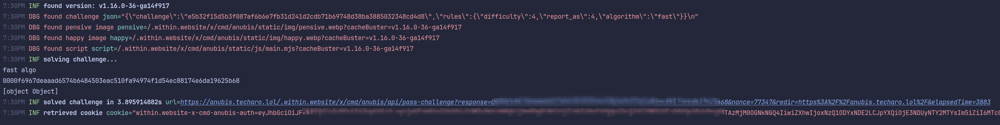

# Anubis POW Solver

Solves proof-of-work challenges served by [TecharoHQ/anubis](https://github.com/TecharoHQ/anubis) (https://anubis.techaro.lol/).

## Screenshot

## Why?
Bots will always find a way to bypass WAFs while real users are forced to waste CPU cycles on a loading screen. This is a proof of concept to show how easy it is to bypass this type of antibot protection.

## Goals
To make this a little more interesting for myself, I set some goals for this project:

- Use the [V8](https://v8.dev/) engine directly to execute the JavaScript code dynamically. No browser automation. No hardcoding.
- Make (almost) no changes to the original challenge JS bundle.
- Speed.

## Usage
TODO
